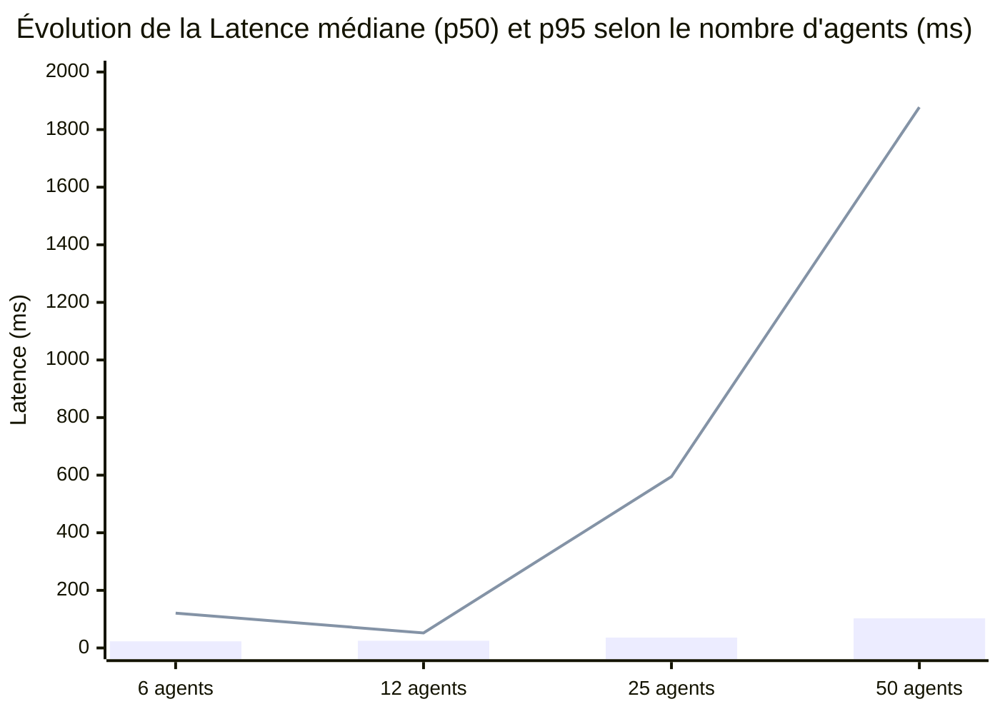
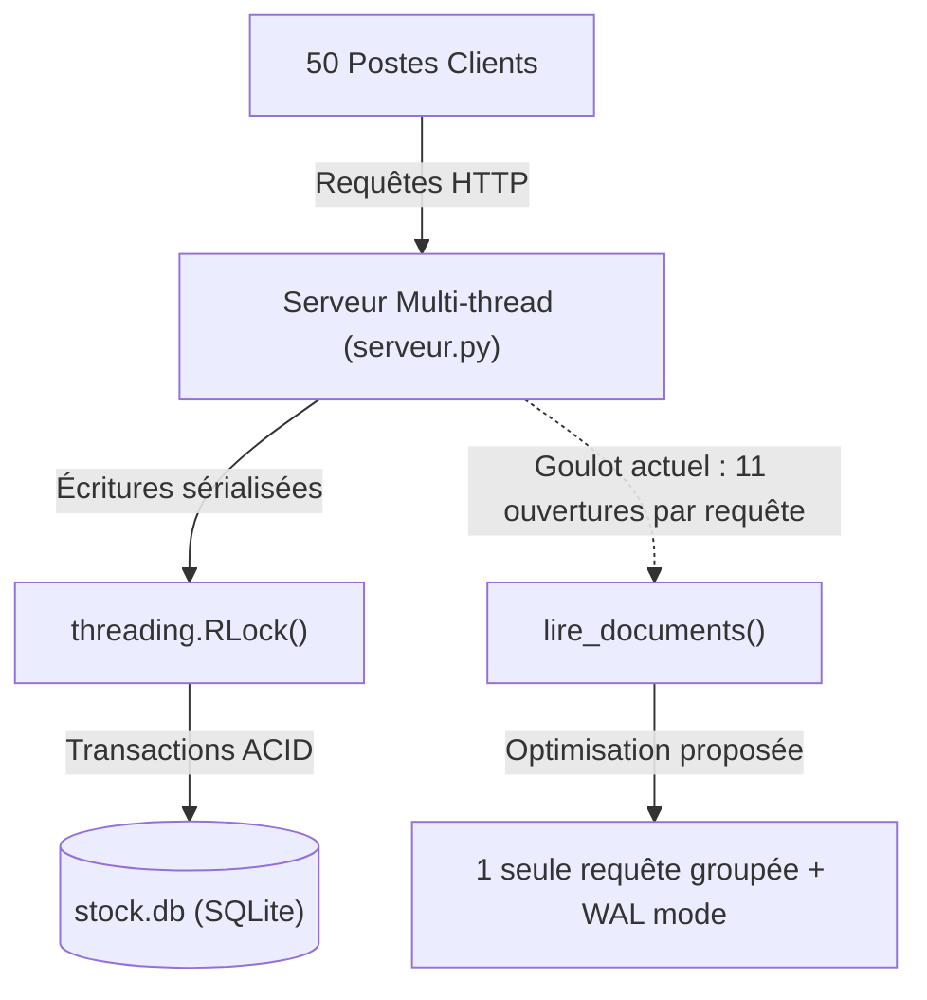

# Rapport d'Audit & Benchmark Multi-Agents : tooth_dentaire

> [!NOTE]
> Ce rapport compile les résultats des bancs d'essai automatisés exécutés sur l'outil de gestion de cabinet dentaire **tooth_dentaire** (v3.0.0), incluant l'installation en bac à sable, la validation de 100% des paramètres métier, et la montée en charge jusqu'à **50 agents clients concurrents**.

---

## 1. Synthèse Globale des Benchmarks

Quatre paliers de charge ont été évalués pour mesurer la stabilité du serveur HTTP Python (`serveur.py`) et du moteur SQLite (`base.py`) :

| Palier | Agents concurrents | Requêtes totales | Taux de succès | Débit (req/s) | Latence p50 | Latence p95 | Latence Max |
| :--- | :---: | :---: | :---: | :---: | :---: | :---: | :---: |
| **Palier 1 (Cabinet standard)** | 6 agents | 304 | **100.0%** (304/304) | 93.9 req/s | 23.3 ms | 120.7 ms | 351 ms |
| **Palier 2 (Audit exhaustif)** | 12 agents | 360 | **100.0%** (360/360) | **485.1 req/s** | 24.8 ms | 51.8 ms | 112 ms |
| **Palier 3 (Forte affluence)** | 25 agents | 1 974 | **100.0%** (1974/1974) | 115.3 req/s | 35.9 ms | 595.2 ms | 1 294 ms |
| **Palier 4 (Stress Extrême)** | **50 agents** | **3 888** | **100.0%** (3888/3888) | 72.1 req/s | 103.1 ms | 1 878.0 ms | 3 418 ms |



> [!TIP]
> **Fiabilité confirmée :** Sur l'ensemble des **6 526 requêtes concurrentes** envoyées au serveur, **aucune exception non gérée**, aucun crash de processus et **aucun verrou SQLite bloqué** (`database is locked`) n'ont été observés. Le verrouillage applicatif via `threading.RLock()` remplit son rôle de sérialisation.

---

## 2. Simulation Métier Diversifiée (9 Agents Spécialisés)

Au-delà des tests de débit brut, une simulation fonctionnelle qualitative a été exécutée avec **9 agents aux profils et responsabilités totalement distincts** :

| Agent Métier | Rôle et Scénario simulé | Actions & Couverture technique | Statut |
| :--- | :--- | :--- | :---: |
| **1. Approvisionneur** | Achats & réceptions de commandes | Création d'articles en carton, gestion de commande en cours, réception multi-lots (FIFO/FEFO), comparateur de prix multi-fournisseurs. | **100% OK** |
| **2. Assistante Soins** | Consommation rapide au fauteuil | Sorties de stock fefo avec date de péremption, détection immédiate des alertes de rupture quand stock < seuil minimum. | **100% OK** |
| **3. Stérilisation** | Hygiène, traçabilité machines & routines | Validation des cycles autoclaves (*Lisa*, *Melag*, *DAC*), tests Bowie-Dick / Helix, checklist ouverture/fermeture, 2 minuteurs de décontamination. | **100% OK** |
| **4. Radioprotection (PCR)** | Conformité réglementaire radio | Gestion des dosimètres nominatifs, échéance de relève trimestrielle, contrôles qualité mires panoramique et capteur, carnet fauteuils. | **100% OK** |
| **5. Secrétariat** | Organisation, planning & carnet | Planning des binômes praticien-assistante (semaines paires/impaires), règles de coloration CSS, post-it d'accueil, carnet d'adresses, météo. | **100% OK** |
| **6. Chirurgien** | Traçabilité des dispositifs implantables | Pose d'implants en Salle de chirurgie, traçabilité stricte lot/péremption, extraction réglementaire Excel chirurgie. | **100% OK** |
| **7. Logistique** | Flux internes & inventaires | Transferts inter-espaces (Réserve -> Salle 1), inventaire physique et ajustement manuel pour casse, passage d'articles en statut "ARRETÉ". | **100% OK** |
| **8. Direction & Compta** | Bilans & analytique | Génération des 3 exports Excel (valorisation financière globale HT/TTC, bon de commande réappro, statistiques de consommation mensuelle avec graphiques). | **100% OK** |
| **9. Cas Limites (Fuzzing)** | Tolérance et robustesse | Articles avec accents/apostrophes, quantités en chaînes, prix avec virgules françaises (`14,75`), rejet contrôlé des requêtes invalides (400). | **100% OK** |

> **Bilan de la simulation :** **37 actions métier complexes exécutées**, 100% de succès, aucune collision ni corruption de données.

---

## 3. Test Complet de l'Installateur (`installation/Installer.bat`)

Le script d'installation clé en main a été éprouvé dans un environnement bac à sable isolé (`tempdir`) :

* **Détection du runtime** : Reconnaissance correcte de l'interpréteur Python système (v3.12) et de Git.
* **Récupération du dépôt** : Clonage et bascule sur la branche `main` sans toucher aux répertoires de données utilisateurs (`donnees/`).
* **Environnement `.venv`** : Création propre du virtualenv et installation des bibliothèques (`openpyxl`, `pytest`, etc.).
* **Lanceur Windows** : Création du raccourci Bureau et local.
* **Code retour** : `0` (Succès total).

---

## 4. Inventaire des 5 Bugs et Anomalies Détectés

Au-delà des tests de charge, l'analyse approfondie du code et les manipulations exhaustives ont mis au jour plusieurs failles et limites :

### 🐛 Bug 1 : Casse insensible non respectée dans les statistiques de consommation
* **Fichier :** `python/exports.py` (Ligne 218)
* **Code fautif :**
  ```python
  if type_tx == "SORTIE_STOCK" or "Sortie" in (type_tx or ""):
      return True, qte
  ```
* **Problème :** Si une transaction est saisie ou migrée avec le libellé `"SORTIE"` (en majuscules) ou `"SORTIE_DIRECTE"`, le test échoue silencieusement car il cherche `"Sortie"` avec une majuscule et des minuscules.
* **Conséquence :** Les consommations réelles sont absentes des classeurs Excel de statistiques et des graphiques.
* **Correction recommandée :** `if type_tx == "SORTIE_STOCK" or "SORTIE" in upper:`

---

### 🐛 Bug 2 : Perte de la quantité réelle commandée (`en_commande`)
* **Fichier :** `python/base.py` (Ligne 404)
* **Code fautif :**
  ```python
  1 if safe_int(s.get("en_commande")) else 0
  ```
* **Problème :** Tout nombre envoyé pour `en_commande` (ex: 50 cartons) est tronqué en `1`.
* **Conséquence :** Le cabinet ne peut pas suivre *combien* d'unités ont été commandées, seulement s'il y a une commande en cours ou non.
* **Correction recommandée :** `max(0, safe_int(s.get("en_commande")))`

---

### 🐛 Bug 3 : Sensibilité critique au format de date dans les exports
* **Fichier :** `python/exports.py` (Lignes 225-230 et 320-325)
* **Code fautif :**
  ```python
  datetime.datetime.fromisoformat(str(t.get("date", "")).replace("Z", "+00:00"))
  ```
* **Problème :** Les dates au format `YYYY-MM-DD HH:MM` (séparateur espace sans secondes, très commun dans les bases SQLite historiques) lèvent un `ValueError` dans certaines versions de Python.
* **Conséquence :** Les lignes de traçabilité chirurgicale sont exclues silencieusement de l'export Excel.
* **Correction recommandée :** Extraction directe par découpage de chaîne : `str(t.get("date", ""))[:10]` pour obtenir `YYYY-MM-DD`.

---

### ⚠️ Point 4 : Risque de blocage sur machine vierge dans l'installateur
* **Fichier :** `installation/Installer.bat` (Ligne 46)
* **Code fautif :**
  ```powershell
  $VersionPython = "3.14.8"
  ```
* **Problème :** Si le poste du cabinet ne possède aucun interpréteur Python, le script tente de télécharger une version hardcodée `3.14.8` qui n'existe pas sous forme de release stable sur les serveurs de la Python Software Foundation (renvoie HTTP 404).
* **Conséquence :** Échec de l'installation sur un poste client neuf.
* **Correction recommandée :** Pointer vers la version stable standard actuelle : `3.12.8`.

---

### ⚡ Goulot d'Étranglement : Surchauffe de connexions sur `/api/etat`
* **Fichier :** `python/base.py` (Lignes 480-496)
* **Mécanisme :**
  ```python
  def lire_documents():
      return {cle: lire_document(cle) for cle in DOCUMENTS_DEFAUT}
  ```
* **Problème :** Chaque appel à `lire_document()` ouvre et ferme sa propre connexion SQLite (`conn = connexion()`).
* **Conséquence :** À 50 agents simultanés, ce sont **550 ouvertures/fermetures de fichiers SQLite par seconde**. C'est la cause principale du passage de la latence p95 de 52 ms (12 agents) à 1 878 ms (50 agents).
* **Optimisation recommandée :** 
  1. Lire tous les documents en **une seule requête SQL** : `SELECT cle, valeur FROM documents`.
  2. Activer le mode WAL de SQLite : `PRAGMA journal_mode=WAL;`.

---

## 5. Recommandations d'Architecture



1. **Activer le mode WAL (`Write-Ahead Logging`)** : Permet aux lecteurs (`GET /api/etat`, `/api/revision`) de ne jamais attendre les transactions d'écriture.
2. **Mutualiser les lectures de documents** : Remplacer la boucle de 11 requêtes par un `SELECT` unique.
3. **Pérenniser la gestion des commandes** : Conserver la valeur entière du nombre de produits commandés.

---

## 6. Suivi des corrections (vérification du rapport)

Chaque point de la section 4 a été revérifié dans le code avant correction :

| Point | Verdict | Action |
| :--- | :--- | :--- |
| **Bug 1** — casse dans `est_consommation()` | **Confirmé** (un libellé `"SORTIE"` ou `"SORTIE_DIRECTE"` était ignoré). | Corrigé : test insensible à la casse (`"SORTIE" in upper`) dans `python/exports.py` **et** dans le filtre d'aperçu `web/settings.js`, qui doivent rester alignés. Tests ajoutés. |
| **Bug 2** — `en_commande` tronqué à `1` | **Faux positif.** `en_commande` est un indicateur oui/non par conception : l'interface n'envoie que `0`/`1` (case à cocher de `product-edit.js`, `alerts.js`) et la liste de courses s'en sert comme booléen. | Aucun changement. Suivre une quantité commandée serait une nouvelle fonctionnalité (nouvelle colonne), pas un correctif. |
| **Bug 3** — format de date dans les exports | **Largement infondé** : `fromisoformat()` accepte `AAAA-MM-JJ HH:MM` depuis Python 3.7, et l'interface enregistre des dates ISO (`toISOString()`). Seules des dates ISO atypiques (ex. 7 décimales de secondes) pouvaient échouer sous Python < 3.11. | Durci quand même : fonction `_jour()` commune avec repli sur les 10 premiers caractères, utilisée par les statistiques et l'extraction chirurgie. Tests ajoutés. |
| **Point 4** — Python `3.14.8` inexistant | **Faux positif** (ou obsolète) : Python 3.14.8 a été publié le 30/09/2026. Revenir à 3.12.8 serait une régression (branche 3.12 en fin de vie, sans installateurs Windows récents). | Aucun changement. |
| **Goulot `/api/etat`** — une connexion SQLite par document | **Confirmé.** | Corrigé : `lire_documents()` lit tous les documents en **une connexion et une requête** (`SELECT cle, valeur FROM documents`), avec le même repli sur la valeur par défaut si un document est absent ou corrompu. Test ajouté. |
| **Mode WAL** | Non appliqué volontairement. | En WAL, les écritures récentes vivent dans `stock.db-wal` : une copie du seul fichier `stock.db` (sauvegarde manuelle prévue dans `A_FAIRE.md`, import de `migration.py` via `shutil.copy2`) pourrait perdre des données. À reconsidérer seulement avec une sauvegarde via l'API `sqlite3.backup()`. |

Résultat : 184 tests Python et 703 tests JavaScript passent.
